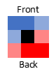

# Shields

Each shield type has a set of target wheels for which they provide standard cover. If you are holding your shield (as opposed to using enarmes), you gain advantage on all block checks made against attacks that would hit these target wheels. 

Facing is particularly important for shields. Of the four squares comprising a character’s front and shield-side flank, the center two squares are considered to be the shield’s primary zone. You automatically succeed at block checks (with no need to roll) against all attacks from those squares (and from those directions for projectile and area of effect attacks) that would otherwise hit a target wheel within your shield’s range of standard cover. The diagram to the right represents a medium character fighting with a shield in its left hand. The dark blue is the shield’s primary zone, where attacks against target wheels in their standard cover are automatically Blocked. 

When you attempt a block check to defend your head, you must raise your shield. You may also choose to raise your shield whenever you take a Movement action or the Defend action. While your shield is raised, the lowest target wheel in your shield’s Standard Cover (noted in parentheses) is replaced with your head. However, against opponents in (and behind) your shield’s primary zone, you suffer disadvantage on defensive combat maneuvers and do not threaten attacks of opportunity. You lower your shield when you block any attack not in your (new) Standard Cover, by spending a reaction to do so (after at least one action has occurred), or if you choose to do so while taking a Movement or Defend action.

