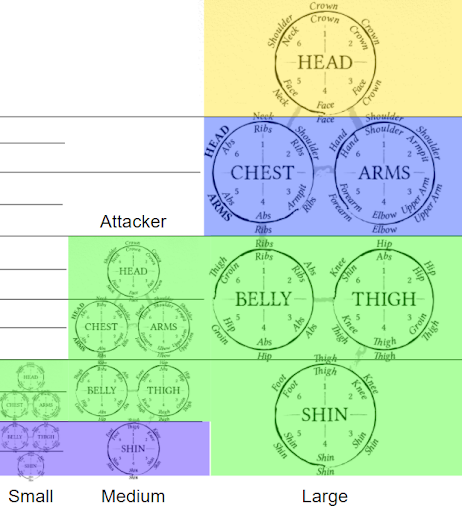

# Size and Reach

Size categories are the same as Pathfinder or 3.5. The basic combat rules are for interacting with targets within one size category of yourself. If the size difference between you and your target is two or more size categories, see the “Fighting Behemoths” section. If the attacker and defender are not the same size category, that larger party receives advantage on initiating or resisting Beat, Bind, Block, Disarm, Drive, Grapple, Shove, and Trip attempts.

Creatures have different reach, measured in half-foot increments. For bipedal creatures, your base reach is equal to half of your height rounded down to the nearest half foot. Weapons, special abilities and spells may modify this reach. Weapons modify it additively, meaning that you add the reach of your weapon to your base reach to determine your reach with that weapon. You need at least 2.5 feet of reach to target an adjacent square. Each square beyond that requires an additional 5 feet of reach. 

Most attacks in melee combat require that you choose a target wheel. If you select a target wheel that is at least partially within one vertical level from the origin of your attack (normally Arms for held weapons, but may be Head for a bite attack or Thigh for a kick), you suffer no additional reach penalty. These levels are based on the attacking creature’s size and are represented by horizontal lines in the graphic above. For example, a medium creature making an attack with a held weapon suffers no reach penalty when targeting the Head, Chest or Arms of a Small creature, the Belly, Thigh or Shins of a Large creature, or any part of a Medium creature besides the Shin (green area). For each vertical level (based on your size) beyond that zone, you suffer a reach penalty (0.5 feet for small creatures, 1 foot for medium and 2 feet for large). When attacking a larger creature, calculate the number of vertical levels to the far side of the target zone.  For example, a medium creature would reduce their reach by one when targeting a small character’s Belly, Thigh or Shins or a Medium creature’s Shins (purple area). They would reduce their reach by two feet when targeting a Large creature’s Chest or Arms (blue area), or by four when targeting a Large creature’s head (yellow area). If the attacker and defender are not on the same horizontal plane (e.g. one creature is standing on a table), determine the vertical level of the origin of the attack and apply the above rules from that starting point. 

Smaller targets are harder to hit. You gain advantage on all attack rolls targeted at creatures of a larger size category and disadvantage against creatures of a smaller size category. However, size also affects how hard a hit you can take. All physical damage is scaled to by size category. For each size category above the attacker’s, damage is halved; for each size category below, damage is doubled. Apply damage reduction before applying the size multiplier to damage.
Size categories are the same as Pathfinder or 3.5. The basic combat rules are for interacting with targets within one size category of yourself. If the size difference between you and your target is two or more size categories, see the “Fighting Behemoths” section. If the attacker and defender are not the same size category, that larger party receives advantage on initiating or resisting Beat, Bind, Block, Disarm, Drive, Grapple, Shove, and Trip attempts.

Creatures have different reach, measured in half-foot increments. For bipedal creatures, your base reach is equal to half of your height rounded down to the nearest half foot. Weapons, special abilities and spells may modify this reach. Weapons modify it additively, meaning that you add the reach of your weapon to your base reach to determine your reach with that weapon. You need at least 2.5 feet of reach to target an adjacent square. Each square beyond that requires an additional 5 feet of reach. 

Most attacks in melee combat require that you choose a target wheel. If you select a target wheel that is at least partially within one vertical level from the origin of your attack (normally Arms for held weapons, but may be Head for a bite attack or Thigh for a kick), you suffer no additional reach penalty. These levels are based on the attacking creature’s size and are represented by horizontal lines in the graphic above. For example, a medium creature making an attack with a held weapon suffers no reach penalty when targeting the Head, Chest or Arms of a Small creature, the Belly, Thigh or Shins of a Large creature, or any part of a Medium creature besides the Shin (green area). For each vertical level (based on your size) beyond that zone, you suffer a reach penalty (0.5 feet for small creatures, 1 foot for medium and 2 feet for large). When attacking a larger creature, calculate the number of vertical levels to the far side of the target zone.  For example, a medium creature would reduce their reach by one when targeting a small character’s Belly, Thigh or Shins or a Medium creature’s Shins (purple area). They would reduce their reach by two feet when targeting a Large creature’s Chest or Arms (blue area), or by four when targeting a Large creature’s head (yellow area). If the attacker and defender are not on the same horizontal plane (e.g. one creature is standing on a table), determine the vertical level of the origin of the attack and apply the above rules from that starting point. 

Smaller targets are harder to hit. You gain advantage on all attack rolls targeted at creatures of a larger size category and disadvantage against creatures of a smaller size category. However, size also affects how hard a hit you can take. All physical damage is scaled to by size category. For each size category above the attacker’s, damage is halved; for each size category below, damage is doubled. Apply damage reduction before applying the size multiplier to damage.

